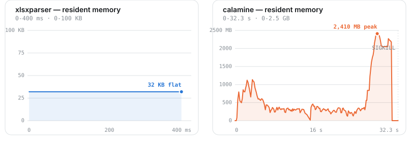
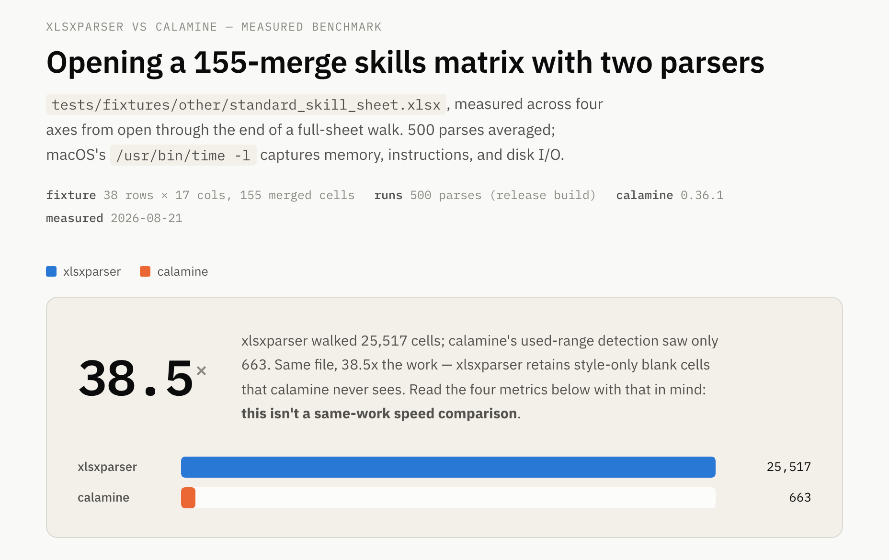
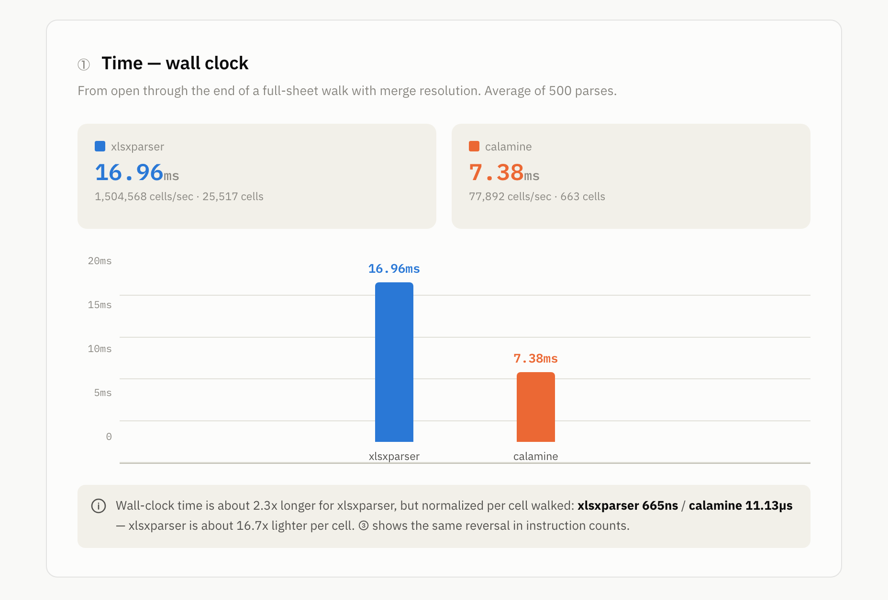

# xlsxparser

[](https://github.com/MinamiyamaKotaro/xlsxparser/actions/workflows/rust-ci.yml)
[](https://github.com/MinamiyamaKotaro/xlsxparser/actions/workflows/docs.yml)
[](https://crates.io/crates/xlsxparser)
[](https://codecov.io/gh/MinamiyamaKotaro/xlsxparser)
[](LICENSE)

A lightweight, high-performance `.xlsx` (OOXML) parser library written in Rust.

## Motivation

`xlsxparser` aims to be a fast, low-memory `.xlsx` parser, purpose-built for
the kind of files common in Japanese business systems: sheets with an
extreme number of rows/columns ("方眼紙Excel") and heavy use of merged
cells. The
goal is to parse and analyze such files without loading a full in-memory
grid, and to expose the result as JSON that's easy to consume from a
frontend or another system.

## Status

Core implementation complete — every module in the planned architecture
below is implemented and tested against the design in `docs/design/`. The
public API (`parse_workbook`, `parse_workbook_reader`, `to_json_string`,
`to_json_writer`, `resolve_color`) is wired up in `src/lib.rs`.

```rust
let workbook = xlsxparser::parse_workbook("book.xlsx")?;
let json = xlsxparser::to_json_string(&workbook)?;
```

- [docs/requirement/requirements.en.md](docs/requirement/requirements.en.md) —
  the functional requirements and the 5-phase pipeline summarized below
  (also available in [Japanese](docs/requirement/requirements.md)).
- [docs/design/architecture.en.md](docs/design/architecture.en.md) — the
  overall `src/` directory layout, module responsibilities, and design
  principles (also available in [Japanese](docs/design/architecture.md)).
  It links out to a per-module design doc for every file, covering
  responsibility/scope, key types and function signatures, dependencies,
  error handling policy, testing strategy, and open questions — each doc
  written in both Japanese and English (`*.md` / `*.en.md`). Where
  implementation diverged from a design doc's draft (an external API
  detail settled differently than planned, a bug found while writing
  tests, etc.), the doc was updated in place to record what changed and why.

## Input / Output

**Input**: a `.xlsx` file, via one of two entry points —

- `parse_workbook(path)` — the common case, reads from a filesystem path.
- `parse_workbook_reader(reader)` — from anything `Read + Seek` (an
  in-memory buffer, a fully-read HTTP response body, ...), for callers that
  don't go through the filesystem.

Both return `Result<Workbook, Error>`, a fully resolved in-memory
representation of every sheet (visible, hidden, and veryHidden alike). Each
has a `_with_limits` variant taking an explicit `SizeLimits` to override the
defaults: a 512 MiB Zip Bomb cap per ZIP entry, 2 GiB cumulative, and a
5,000,000-cell cap per sheet (`Error::TooManyCells`) — the cell cap bounds
a sheet's in-memory footprint independently of its raw XML byte size,
since a pathologically cell-dense file can stay well under the byte-size
cap while still costing gigabytes once every `<c>` materializes.

**Output**: `to_json_string(&workbook)` / `to_json_writer(&workbook,
writer)` serialize the resolved `Workbook` into JSON shaped like this
(real output, from `tests/fixtures/complex/houganshi_merged.xlsx` — a
sheet with a single merged region, `A1:C3`, holding one text cell):

```json
{
  "sheets": [
    {
      "name": "Sheet1",
      "visibility": "visible",
      "maxRow": 3,
      "maxCol": 3,
      "defaultColumnWidth": null,
      "columns": [],
      "cells": [
        {
          "row": 1,
          "col": 1,
          "value": { "type": "text", "value": "houganshi" },
          "rowSpan": 3,
          "colSpan": 3
        }
      ],
      "images": []
    }
  ]
}
```

- `visibility` is `"visible"`, `"hidden"`, or `"veryHidden"` (from `<sheet
  state="...">`).
- `maxRow`/`maxCol` are the sheet's bounding box (the highest populated or
  merged coordinate) — not the OOXML `<dimension>` value, which isn't read
  at all.
- `columns` is the sheet's `<cols>` ranges (`{"min", "max", "width"}`,
  1-based and inclusive), each entry covering every column in that range —
  not one `columnWidth` value duplicated onto every cell, since that would
  multiply output size for no benefit (see
  [Sparse merged-cell arrangements](#sparse-merged-cell-arrangements)
  below for the same principle applied to merged cells). `defaultColumnWidth`
  is `<sheetFormatPr defaultColWidth="..">`'s value, or `null` if the
  workbook doesn't set one; a column not covered by any `columns` entry
  falls back to it. Neither fixture used in these two examples declares
  `<cols>`, so both show the empty/absent case.
- `cells` only contains populated coordinates: a blank cell in between is
  simply absent, never emitted as a `null`/`"empty"` entry (see
  [Motivation](#motivation)). Cells are ordered row-major, then
  column-major (matching reading order), regardless of the order they
  appear in the source XML — the sheet is backed by a `BTreeMap`, keyed
  on `(row, col)`.
- Each cell's `value` is tagged by `type`:
  `"number"` | `"text"` | `"boolean"` | `"error"` | `"dateTime"` |
  `"empty"` (a cell with formatting only, or a value JSON can't
  represent — `NaN`/`±Infinity`).
  `"dateTime"` serializes as ISO 8601 with no timezone designator or
  fractional seconds (e.g. `"2023-06-15T00:00:00"`; a date-only cell gets a
  midnight time component, since Excel itself doesn't distinguish
  date-only from date+time as a type).
- `rowSpan`/`colSpan` are present (and `> 1`) only on a merged region's
  anchor cell; every other coordinate inside the region resolves to that
  same anchor and is not emitted as a separate JSON cell.
- `style` is present only when the cell carries a resolved style at all
  (omitted entirely otherwise, not emitted as `"style": {}`):
  - `font`: `{"sizePt": 11.0, "bold": false}`.
  - `wrapText`: boolean.
  - `alignment`: the horizontal alignment as a string — `"general"` |
    `"left"` | `"center"` | `"right"` | `"fill"` | `"justify"` |
    `"centerContinuous"` | `"distributed"`. Always present (unlike
    `numberFormat` below, `"general"` is itself a meaningful value, not
    "nothing to report").
  - `numberFormat`: the resolved format code as a string (e.g. `"0%"`,
    `"yyyy-mm-dd"`), covering both the built-in numFmtId table
    (ECMA-376 §18.8.30) and custom `<numFmt>` codes. Omitted when the
    format is `"General"` (no special formatting to report).
  - `fillFgColor`/`fillBgColor`: the cell's fill color, tagged by `type`
    exactly as `<fgColor>`/`<bgColor>` specify it — `{"type": "rgb",
    "value": "FFFF0000"}` | `{"type": "theme", "value": {"index": 4,
    "tint": -0.25}}` | `{"type": "indexed", "value": 64}`. Kept in this
    raw, unresolved form rather than converted to a final displayed RGB
    value: xlsxparser's output is for diffing, so knowing *that* a fill
    color changed doesn't require knowing what it actually renders as.
    Omitted when the fill has no foreground/background color at all. When
    the actual displayed color *is* needed, `resolve_color` converts any
    of these three forms to a real RGB value on demand — see
    [Resolving display colors](#resolving-display-colors) below.
  - `borders`: `{"top": bool, "right": bool, "bottom": bool, "left": bool}`
    — whether each side carries a border at all (line style/weight/color
    are not reported; `<diagonal>` is not tracked). Omitted entirely when
    no side has one, the same "nothing to report" treatment as
    `fillFgColor`/`fillBgColor` — never emitted as all-`false`.
- `hyperlink` is present only when the cell carries one (omitted
  otherwise, not emitted as `"hyperlink": {}`): `{"target": "...",
  "location": "...", "tooltip": "..."}`, each field itself omitted when
  absent. `target` is the resolved external URL or internal part path
  (from the worksheet's own relationships); `location` is an in-workbook
  jump (e.g. `"Sheet2!A1"`) present on internal hyperlinks instead of, or
  alongside, `target`. Kept raw, exactly like `fillFgColor`/`fillBgColor`
  — the target/location string is never checked for existence and never
  fetched, so a hyperlink pointing at a since-deleted sheet or a dead URL
  still round-trips unchanged (diffing, not following, is the point). A
  `ref` spanning multiple cells (`<hyperlink ref="A1:B1">`) attaches
  independently to every cell in the range that already carries a value
  or style of its own; a cell with no value/style/hyperlink of its own is
  never materialized, even inside such a range.
- `images` is the sheet's cell-anchored embedded images (always present,
  even as an empty array — unlike `style`, which is omitted per-cell when
  absent). See [Embedded images](#embedded-images) below for its shape.

A second real example — every `CellValue` variant in one row
(`tests/fixtures/normal/basic_types.xlsx`; cells re-ordered by column here
for readability, since actual order is unspecified):

```json
{
  "sheets": [
    {
      "name": "Sheet1",
      "visibility": "visible",
      "maxRow": 1,
      "maxCol": 7,
      "defaultColumnWidth": null,
      "columns": [],
      "cells": [
        { "row": 1, "col": 1, "value": { "type": "text", "value": "日本語Text" } },
        { "row": 1, "col": 2, "value": { "type": "number", "value": 42.0 } },
        { "row": 1, "col": 3, "value": { "type": "number", "value": 19.99 } },
        {
          "row": 1, "col": 4,
          "value": { "type": "dateTime", "value": "2023-06-15T00:00:00" },
          "style": {
            "font": { "sizePt": 11.0, "bold": false },
            "wrapText": false,
            "alignment": "general",
            "numberFormat": "yyyy-mm-dd"
          }
        },
        { "row": 1, "col": 5, "value": { "type": "boolean", "value": true } },
        { "row": 1, "col": 6, "value": { "type": "boolean", "value": false } },
        { "row": 1, "col": 7, "value": { "type": "error", "value": "#N/A" } }
      ],
      "images": []
    }
  ]
}
```

(Column 4 is a date cell — its `numberFormat` comes from the cell's
`<xf numFmtId="...">`, resolved against `xl/styles.xml`'s built-in/custom
`<numFmt>` table; `openpyxl`'s default date format is `"yyyy-mm-dd"`.)

A third real example — a sheet that does declare `<cols>`
(`tests/fixtures/normal.rs`'s `column_widths()`: `<col min="1" max="3"
width="12.5"/>`, `<col min="5" max="5" width="30"/>`, and
`<sheetFormatPr defaultColWidth="9.1"/>`):

```json
{
  "maxRow": 1,
  "maxCol": 5,
  "defaultColumnWidth": 9.1,
  "columns": [
    { "min": 1, "max": 3, "width": 12.5 },
    { "min": 5, "max": 5, "width": 30.0 }
  ],
  "cells": [
    { "row": 1, "col": 1, "value": { "type": "number", "value": 1.0 } },
    { "row": 1, "col": 5, "value": { "type": "number", "value": 2.0 } }
  ]
}
```

Column 4 falls in the gap between the two `columns` ranges, so a cell there
(none exist in this example) would fall back to `defaultColumnWidth`
(9.1) rather than either range's `width`.

## Embedded images

`images` is a sheet-level array of cell-anchored embedded images
(`xl/drawings/drawingN.xml`) — real output, from
`tests/fixtures/complex/embedded_image.xlsx` (one image anchored `B2:E9`
with a hyperlink; `cells`/`columns` omitted below for brevity):

```json
{
  "images": [
    {
      "anchor": {
        "type": "twoCell",
        "from": { "row": 2, "col": 2, "colOff": 10000, "rowOff": 20000 },
        "to": { "row": 9, "col": 5, "colOff": 0, "rowOff": 0 }
      },
      "target": "xl/media/image1.png",
      "hyperlink": "https://example.com/sample-image"
    }
  ]
}
```

- `anchor` is tagged by `type`: `"twoCell"` (stretches between two cell
  corners, `from`/`to`) or `"oneCell"` (`from` plus an `ext: {"cx", "cy"}`
  size in EMU — a `oneCell` anchor has no `to` marker, since its size is
  independent of any cell boundary). `row`/`col` are 1-based, matching
  every other cell coordinate this crate emits; `colOff`/`rowOff` are the
  EMU-unit offset *within* that cell (kept rather than rounded away, so a
  diff can distinguish an image nudged a few pixels from one that hasn't
  moved).
- `target` is the embedded media part's resolved path (e.g.
  `"xl/media/image1.png"`) — never the image's own bytes, which stay
  entirely out of scope (a diff-oriented tool has no use for pixel data,
  and reading it would scale memory use with image count rather than
  cell count).
- `hyperlink` is the image's own hyperlink (`a:hlinkClick`), distinct from
  a cell hyperlink (a `JsonCell`-level field — see above). Omitted when the
  image carries none. An `Internal` (in-package) target resolves to a
  ZIP-entry-name-equivalent path the same way `target` does; an
  `External` one (a URL, as above) is kept verbatim.
- Grouped images (`<xdr:grpSp>`) resolve each contained `<xdr:pic>`'s
  anchor relative to its enclosing group, flattened into this same
  per-sheet `images` array — no separate group structure is exposed.

## Resolving display colors

`fillFgColor`/`fillBgColor` above are kept raw because xlsxparser's
primary purpose is diffing, not rendering — but when a caller does need
to know the actual color a cell displays as (not just whether it
changed), `resolve_color` converts any of the three `ColorRef` forms
(`rgb` / `theme`+`tint` / `indexed`) into a real `Rgb { r, g, b }` value
on demand:

```rust
use xlsxparser::{parse_workbook, resolve_color, CellRef};

let workbook = parse_workbook("book.xlsx")?;
let sheet = &workbook.sheets()[0];
let cell = sheet.get(CellRef { row: 1, col: 1 }).unwrap();

if let Some(color_ref) = cell.style.as_ref().and_then(|s| s.fill_fg_color.as_ref()) {
    let rgb = resolve_color(color_ref, workbook.theme());
    // e.g. Some(Rgb { r: 0x4F, g: 0x81, b: 0xBD })
}
```

- `theme`+`tint` references resolve against the workbook's
  `xl/theme/theme{N}.xml` `<clrScheme>` (`Workbook::theme()`), applying
  ECMA-376's tint luminance correction, and return `None` if the
  workbook has no theme part at all or the referenced slot index is out
  of range.
- `indexed` references resolve against the legacy ECMA-376 64-color
  palette; `indexed=64`/`65` (the "system foreground"/"system
  background" special values) resolve to fixed `#000000`/`#FFFFFF`,
  independent of any OS system palette (this crate runs headless).
- `resolve_color` never panics on malformed input (an out-of-range theme
  index, a non-finite `tint`, malformed hex) — it returns `None` instead.
- `xl/theme/theme{N}.xml` is read and parsed only if the workbook's
  stylesheet actually references a theme color at all
  ("pay-for-what-you-use") — a workbook that never uses one pays zero
  added I/O or CPU cost for this feature, even when the part is present
  in the file.

## Architecture

1. **Relationship resolution** — parse `_rels` parts to build a routing map
   from sheet `r:id` to worksheet file path, then discard the intermediate
   data immediately.
2. **Sanitization** — guard against zip bombs, zip-slip path traversal, and
   XXE before any untrusted content is parsed.
3. **Streaming parse** — a SAX-style reader processes `<sheetData>` one
   `<row>` at a time, without holding the sheet's full XML DOM in memory.
4. **Resolution** — shared strings (`t="s"`) and cell styles are resolved
   against the SST/stylesheet, and `<mergeCells>` ranges are resolved
   against the collected cells after the stream pass completes.
5. **JSON output** — the resolved data model is serialized to structured
   JSON (including `row_span`/`col_span` for merged cells) for downstream
   consumption, as a separate step from the primary `Workbook`-returning API.

Core requirements driving the design:

- **Sparse storage** — cells are kept in a coordinate-keyed map, never a
  dense 2D array, so sparse "grid-paper" sheets stay cheap to hold in memory.
- **Merge-cell transparency** — any coordinate inside a merged range
  resolves (via an O(1) bounding-box pre-check plus a geometric containment
  scan over the sheet's merged regions) to the same value and merge
  metadata as the range's anchor cell.
- **I/O and domain logic stay separated** — XML/ZIP handling (`container/`,
  `parse/`) never mixes with the resolution logic (`resolve/`), which
  operates purely on in-memory data and needs no I/O to unit test.

The module layout (see
[docs/design/architecture.en.md](docs/design/architecture.en.md) for the
full breakdown of each file's responsibility):

```text
src/
  lib.rs        # public API entry point (parse_workbook, parse_workbook_reader, to_json_string, ...)
  error.rs      # crate-wide error type
  pipeline.rs   # orchestrates the 5-phase pipeline and resource lifetimes

  container/    # ZIP (OPC) extraction, zip-bomb/zip-slip guarding
  parse/        # XML parsing (quick-xml usage is confined here), XXE mitigation
  model/        # pure data structures (Workbook, Sheet, Cell, CellValue, ...)
  resolve/      # shared-string/style/merge-cell resolution + on-demand color resolution, I/O-independent

  json.rs       # serializes a resolved Workbook to JSON
```

## OOXML parts covered

- `xl/_rels/workbook.xml.rels`
- `xl/workbook.xml` (including `<workbookPr date1904="...">`, needed to
  resolve a date/time cell's serial value under the 1900 vs. 1904 date
  system)
- `xl/sharedStrings.xml` (rich-text run concatenation, `xml:space="preserve"`
  handling, CDATA runs, and the `_x000D_` escape Excel uses for a literal CR)
- `xl/styles.xml` (font size/bold, horizontal alignment, wrap text,
  number format — both the built-in numFmtId table (ECMA-376 §18.8.30) and
  custom `<numFmt>` codes — fill color, kept in its raw `rgb`/
  `theme`+`tint`/`indexed` form (see
  [Resolving display colors](#resolving-display-colors) for converting it
  to a real RGB value), and border presence per side — line style/weight/
  color and `<diagonal>` are not read)
- `xl/theme/theme{N}.xml` (`<clrScheme>`'s 12 colors — read only when a
  style actually references a theme color; see
  [Resolving display colors](#resolving-display-colors))
- `xl/worksheets/sheetX.xml` (`<sheetData>` — including `t="d"` ISO 8601
  date cells alongside the numeric-serial dates every other date/time
  cell uses, both unified into the same `"dateTime"` output —
  `<mergeCells>`, and `<hyperlinks>`, kept raw/unresolved — see the
  `hyperlink` field above)
- `xl/worksheets/_rels/sheetX.xml.rels` (resolves a `<hyperlink r:id="...">`
  to its raw Target string — read only when the sheet declares at least
  one hyperlink with an `r:id`; a `location`-only internal hyperlink never
  triggers this read)
- `xl/drawings/drawingN.xml` and its own `_rels` (cell-anchored embedded
  images — anchor geometry, the embedded media's resolved path, and the
  image's own hyperlink, including images nested in `<xdr:grpSp>` groups;
  see [Embedded images](#embedded-images) below)

`[Content_Types].xml` is not read at all — the workbook part's actual path
is resolved via `_rels/.rels`'s `officeDocument` relationship rather than
assumed to be the conventional `xl/workbook.xml` (Issue #55), but that
resolution never cross-checks a part's declared Content-Type against
`[Content_Types].xml` (see
[pipeline.en.md Open Question 3](docs/design/pipeline.en.md) for the
rationale and the strict-OPC-conformance tradeoff this makes).

## Benchmarks

The benchmarking was done using [`hyperfine`](https://github.com/sharkdp/hyperfine)
with `--warmup 3` on an `Apple M2 Pro` running `macOS 26.6.1`, comparing
`xlsxparser` (via `parse_workbook`) against
[`calamine`](https://github.com/tafia/calamine) `0.26.1` (via
`worksheet_range`) — a widely-used pure-Rust `.xlsx` reader — both built in
release mode, on `tests/fixtures/complex/extreme_sparse.xlsx`: a real,
openpyxl-authored file where only two cells are populated, `A1` and
`XFD1048576` (Excel's actual maximum: row 1,048,576, column 16,384) — the
sparse "grid-paper Excel" shape this library is purpose-built for (see
[Motivation](#motivation)).

```bash
xlsxparser
  Time (mean ± σ):       3.0 ms ±   1.0 ms    [User: 1.3 ms, System: 1.1 ms]
  Range (min … max):     2.1 ms …  18.3 ms    410 runs
```

`calamine` isn't shown as a completed hyperfine run because it never
completed one: across repeated runs it was killed by the OS for excessive
memory use after roughly 23-24 seconds, having grown to multiple GB of
resident memory. The cause is structural, not a fluke: `calamine`'s
`Range<T>` (the type `worksheet_range` returns) always backs onto a single
dense `Vec<T>` sized to the *bounding box* of the populated cells —
`Range::from_sparse` (`calamine` `0.26.1`, `src/lib.rs`) computes
`cols * rows` from that bounding box and allocates `vec![T::default();
cols * rows]` regardless of how few cells are actually non-empty. Here the
two populated corners span the full sheet, so that bounding box *is*
1,048,576 x 16,384 = 17,179,869,184 elements, and the allocation attempt
is what gets the process killed.

`xlsxparser` doesn't hit this because cells are kept in a coordinate-keyed
`BTreeMap<CellRef, Cell>` (see [Architecture](#architecture) above) sized to
the number of populated cells, never to the sheet's addressable bounding
box — so `extreme_sparse.xlsx` costs `xlsxparser` exactly 2 map entries.

The same run, visualized: resident memory (`ps -o rss`, sampled every
100 ms) for each process from launch to exit —



`xlsxparser`'s line is flat at 32 KB because there's nothing to allocate
beyond the 2 map entries above; `calamine`'s climbs — noisily, as `Vec`
reallocates while growing — until the OS sends `SIGKILL` at 32.2 s, peaking
at 2.35 GB resident on a machine with roughly 58 MB free at the start of
the run (16 GB total). Sampled at 100 ms granularity via a shell loop
polling `ps`, not a profiler, so brief spikes between samples aren't
captured and the true peak may be marginally higher than shown.

### Sparse merged-cell arrangements

A merge-heavy file could hit an unrelated cost even while respecting every
existing limit ([Issue #43](https://github.com/MinamiyamaKotaro/xlsxparser/issues/43)):
two 1x1 merges placed at opposite corners of a sheet stretch the merged-cell
bounding box to cover virtually the whole sheet, so every other cell fell
back to a linear scan over every merged region when resolving its origin —
turning a legitimate file into an O(cells × merged regions) cost during JSON
generation. `Sheet::finalize_merges` closes this with a single sweep-line
pass, independent of how the merges are arranged in space (see
[docs/design/model/sheet.md](docs/design/model/sheet.md)'s "修正:
`finalize_merges`" section for the full story).

Measured the same way as above (`hyperfine`, `--warmup 1`, same machine), on
a generated 838 KB file with 300,000 distinct populated cells and 20,000
merges (`resolve::merge::MAX_MERGE_REGIONS`, the current cap) arranged to
maximize the bounding box (`tests/fixtures/security.rs`'s
`sparse_merge_bounding_box_amplification`):

```bash
before (pre-#43 fix, v0.10.0)
  Time (mean ± σ):     14.918 s ±  0.242 s    3 runs

after (this fix, v0.10.1)
  Time (mean ± σ):     600.6 ms ±   7.9 ms    4 runs
```

### Real-world merge-heavy worksheet vs. calamine

The two benchmarks above are synthetic stress tests. This one is a real,
hand-authored file: `tests/fixtures/other/standard_skill_sheet.xlsx`, a
skills-matrix spreadsheet with 155 merged cells arranged irregularly (`A1:D11`,
`H3:Q3`, `J36:J39`, ...) — the kind of layout that shows up in an actual
business template, not a stress-test generator.

Comparing `xlsxparser` (`parse_workbook` + `iter_cells`) against `calamine`
`0.36.1` (`worksheet_range` + `merge_cells_by_sheet_name`, walked and
merge-resolved the same way), 500 parses averaged in release mode
(`poc/skillsheet-bench-poc/`, a throwaway comparison crate — `calamine` is
not, and was never added as, a dependency of the published package):

| | `xlsxparser` | `calamine` |
|---|---|---|
| wall time / parse | 16.96 ms | 7.38 ms |
| instructions / parse | 200,474,727 | 84,912,087 |
| peak memory footprint | 6.73 MB | 2.38 MB |
| cells walked | 25,517 | 663 |
| **time / cell walked** | **665 ns** | 11.13 µs |
| **instructions / cell walked** | **7,858** | 128,073 |
| block I/O (read + write ops, 500 iterations) | 0 | 0 |



Read as a straight wall-clock race, this looks like a 2.3x loss for
`xlsxparser`. It isn't the same amount of work: `xlsxparser` walked 25,517
cells, `calamine`'s used-range detection saw only 663. The sheet's real data
is 38 rows, but whoever authored it in Excel applied fill/border styling
roughly 1,500 rows deep — `xlsxparser` keeps every one of those style-bearing
blank cells (retaining exactly this kind of cell-level state is the library's
purpose; see [Motivation](#motivation)), while `calamine`'s `Range<Data>` has
no concept of style and never sees them.

Normalized per cell actually walked, the result flips: `xlsxparser` costs
665 ns and 7,858 instructions per cell against `calamine`'s 11.13 µs and
128,073 instructions per cell — roughly **16.7x cheaper per cell**.
`calamine`'s larger per-cell figure isn't inefficiency; it's fixed
zip-decompression and XML-parse overhead amortized over a denominator 38x
smaller. On the other two axes both held up cleanly: peak RSS stayed flat
across all 500 iterations for both (no leak), and `/usr/bin/time -l`'s block
I/O counters read zero for both, confirming neither ever spills to a temp
file (see [Architecture](#architecture)).



## Security notes

- **Zip Bomb / Zip Slip / XXE**: guarded against at parse time (see
  [Architecture](#architecture) above and
  [docs/security/design-review.md](docs/security/design-review.md) for the
  full analysis).
- **CSV / formula injection**: cell string values (including formula-computed
  result strings) pass through unchanged, with no escaping at any stage —
  this is safe as JSON output, but callers who re-export parsed values into
  CSV or another spreadsheet format are responsible for their own
  formula-injection mitigations (e.g. escaping a value that starts with `=`,
  `+`, `-`, or `@`), since a `.xlsx` input is untrusted and this library
  performs no rewriting of cell content.

## License

This project is licensed under the GNU Affero General Public License v3.0 (AGPL-3.0). See the [LICENSE](LICENSE) file for details.

### Commercial Licensing

If you wish to use this software in a proprietary system or without the copyleft obligations of the AGPL-3.0, commercial licenses are available.

Please contact the author via [GitHub Profile](https://github.com/MinamiyamaKotaro) or open an inquiry on [GitHub Discussions](https://github.com/MinamiyamaKotaro/xlsxparser/discussions).
